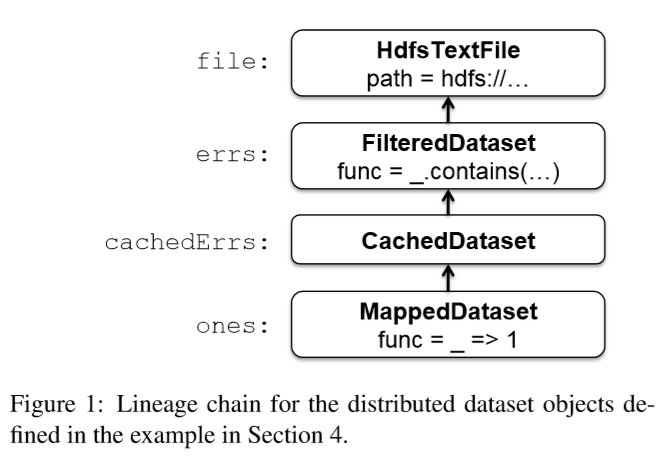
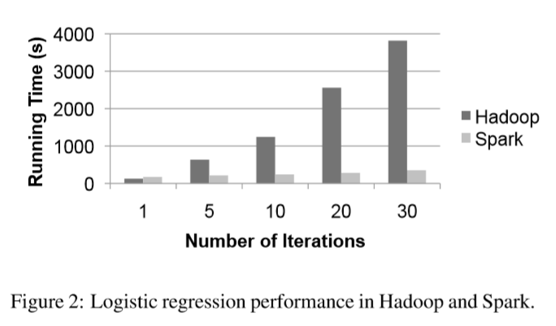

# Spark：具有工作集的集群计算

Matei Zaharia, Mosharaf Chowdhury, Michael J. Franklin, Scott Shenker, Ion Stoica 

University of California, Berkeley

# 摘要

MapReduce及其变体在实现商品集群上的大规模数据密集型应用程序方面非常成功。但大多数这些系统都是围绕非循环数据流模型构建的，该模型不适用于其他流行的应用程序。本文着重于此类应用程序：在多个并行操作之间*重复使用一个数据集*的应用程序。这包括许多迭代式机器学习算法以及一些交互式数据分析工具。我们提出了一个名为Spark的框架，该框架支持这些应用程序，同时保留MapReduce 的可伸缩性和容错能力。为了实现这些目标，Spark引入了称为*弹性分布式数据集*(RDD)的抽象。RDD是在一组计算机上分区的对象的只读集合，如果丢失分区，则可以重建这些对象。在迭代式机器学习中，Spark的性能可比Hadoop高出10倍，并可用于以亚秒级的响应时间交互式查询39 GB的数据集。

# 1引言

集群计算的新模型已广为流行，其中通过自动提供位置感知的调度，容错和负载平衡的系统在不可靠的机器集群上执行数据并行计算。MapReduce[11]率先提出了该模型，而像Dryad[17]和Map-Reduce-Merge[24]，这样的系统则概括了所支持的数据流的类型。这些系统通过提供一种编程模型来实现其可伸缩性和容错能力，在该模型中，用户创建非循环数据流图以将输入数据通过一组运算符传递。这使基础系统无需用户干预即可管理调度并对故障做出反应。

尽管此数据流编程模型对于大量的应用程序很有用，但有些应用程序不能有效地表示为非循环数据流。在本文中，我们专注于这类应用程序：在多个并行操作中*重复使用一个数据集*的应用程序。这包括两个用例，其中我们已经看到Hadoop用户报告MapReduce不足：

-   **迭代作业**：许多常见的机器学习算法将功能*重复应用于同一数据集*以优化参数(例如，通过梯度下降)。虽然每个迭代都可以表示为MapReduce / Dryad的job，但每个job必须从磁盘重新加载数据，从而导致性能显着下降。 

-   **交互式分析**：Hadoop是经常用于运行对大数据集的ad-hoc探索性查询，通过SQL接口，如Pig[21]和Hive[1]。理想情况下，理想情况下，用户可以跨多台机器将感兴趣的数据集加载到内存中，并重复查询。但是，使用Hadoop时，每个查询都会产生大量延迟(数十秒)，因为它作为单独的MapReduce作业运行并从disk读取数据。

本文提出了一个名为Spark的集群计算框架，该框架支持具有工作集的应用程序，同时提供与MapReduce 相似的可伸缩性和容错属性。

Spark中的主要抽象是*弹性分布式数据集*(RDD)，它表示跨一组计算机分区的对象的只读集合，如果丢失分区，则可以重建这些对象。用户可以在计算机之间的内存中显式缓存RDD，并在多个类似MapReduce的*并行操作*中重复使用它。RDD通过沿袭概念实现*容错*：如果RDD 的分区丢失，则RDD拥有足够的信息关于如何从其他RDD派生的，从而能够重建该分区。尽管RDD 并不是通用的共享内存抽象，但它一方面代表了表达性，另一方面又具有可伸缩性和可靠性之间的最佳结合点，我们发现它非常适合各种应用程序。

Spark在Scala [5]中实现，Scala是Java虚拟机的一种静态类型化的高级编程语言，并提供类似于DryadLINQ [25]的功能性编程接口。此外，Spark可以从Scala解释器的修改版本中交互使用，该版本允许用户定义RDDs，函数，变量和类，并在集群上的并行操作中使用它们。我们相信Spark是*第一个允许以交互方式使用高效通用编程语言来处理集群上大型数据集*的系统。

尽管我们实施的Spark仍是原型，但早期使用该系统的经验令人鼓舞。我们展示了Spark在迭代式机器学习工作负载中的性能比Hadoop高出10倍，并且可以交互方式用于扫描39 GB的数据集，且延迟时间不到亚秒。

本文的组织如下：第2部分介绍了Spark的编程模型和RDD。第3节显示了一些示例作业。第4节介绍了我们的实现，包括与Scala及其解释器的集成。第5节介绍了早期结果。我们在第6节中调查了相关工作，并在第7节中进行了讨论。 

# 2编程模型

为了使用Spark，开发人员需要编写一个 *(driver program) 驱动程序*，以实现其应用程序的高级控制流并并行启动的各种操作。Spark为并行编程提供了两个主要的抽象：*(resilient distributed datasets)弹性分布式数据集*和对这些数据集的*(parallel operations)并行操作*(通过传递函数以应用于数据集来调用)。另外，Spark支持两种受限类型的*(shared variables)共享变量*，它们可以在集群上运行的函数中使用，我们将在后面解释。

## 2.1弹性分布式数据集(RDDs)

弹性分布式数据集(RDD)是在一组计算机上分区的对象的只读集合，如果丢失分区，则可以重建这些对象。RDD 的元素不必存在于物理存储中；相反，RDD 的句柄包含足够的信息以从可靠存储中的数据开始(*compute*)计算RDD。这意味着如果节点发生故障，则始终可以重建RDDs。

在Spark中，每个RDD由一个Scala对象表示。Spark使程序员可以通过四种方式构造RDDs：

-   来自共享文件系统中的*文件*，例如Hadoop 分布式文件系统(HDFS)。

-   通过在驱动程序中“*(parallelizing)并行化* “Scala集合(例如，数组)，这意味着将其划分为多个片，这些片将被发送到多个节点。 

-   通过*(transforming)转换*现有的RDD。使用*flatMap*的操作可以将一个(typeA)的数据集转化为一个(typeB)的数据集，这是通过使用函数(type A ⇒ List[B])遍历用户提供的每个元素来实现的。其他转换的操作被表示为类似*flatMap*的操作，包括map(通过函数(type A⇒B)遍历每个元素)和*filter*(选择与谓词匹配的元素)。 

-   通过更改已经存在RDD的*(persistence)持久性*。默认情况下，RDDs是懒惰的和短暂的。也就是说，数据集的分区在并行操作中使用时*(materialized on demand)按需实现*(例如，通过将文件的一个块传递给map函数)，并在使用后从内存中丢弃。但是，用户可以通过两个操作来更改RDD的持久性： 

    -   *(cache)缓存操作*使数据集变得懒惰，这暗示它应在第一次计算后保留在内存中，因为它将被重复使用。 

    -   *(save)保存操作*评估数据集，并写入到一个分布式文件系统，比如HDFS。该保存的版本在未来的操作就可以使用。

我们注意到，我们的*(cache)缓存操作*暗示了：如果集群中没有足够的内存来缓存数据集的所有分区，Spark将在使用它们时*重新计算*它们。我们选择这种设计，以便在*节点发生故障或数据集太大*时，Spark程序可以继续工作(降低性能)。这个想法大致类似于*虚拟内存*。

我们还计划扩展Spark以支持其他级别的持久性(例如，*跨多个节点的内存中复制*)。我们的目标是让用户在存储RDD的成本、访问它的速度、丢失部分的概率和重新计算它的成本之间进行权衡。

## 2.2Parallel Operations并行操作

可以在RDDs上执行几个并行操作：

-   reduce：使用关联函数组合数据集元素，以在驱动程序中产生结果。

-   collect：将数据集的所有元素发送到*(driver program)驱动程序*。例如，并行更新数组的一个简单方法是并行化、映射和收集数组。

-   foreach：对每个元素做用户提供的函数。这样做仅是出于功能的副作用(如下所述，可能是将数据复制到另一个系统或更新共享变量)。

我们注意到，Spark当前不支持MapReduce中的分组化reduce操作。reduce结果仅在一个过程(驱动程序)中收集。如第7节所述，我们计划在将来使用对分布式数据集的*“(shuffle)混洗”*转换来支持*(grouped reductions)分组归约*。但是，即使使用单个*(reducer)归约器*也足以表达各种有用的算法。例如，最近一篇关于MapReduce的多核系统机器学习论文[10]实现了十种学习算法，但不支持并行归约。

## 2.3 Shared Variables共享变量

程序员通过将*(closures functions)闭包函数*传递给Spark来调用诸如map，filter和reduce的操作。正如函数编程中的典型用法一样，这些闭包可以引用创建它们的作用域中的变量。通常，当Spark在工作程序节点上运行闭包函数时，这些变量将复制到工作程序。但是，Spark还允许程序员创建*两种受限类型的共享变量*，以支持两种简单但通用的使用模式：

-   *(Broadcast variables)广播变量*：如果在多个并行操作中*使用了较大的只读数据段*(例如，查找表)，则最好仅将其*分配给工作程序一次*，而不是将其包装在每个闭包中。Spark使程序员可以创建一个“广播变量”对象，该对象包装该值并确保*仅将其复制到每个工作程序一次*。

-   *(Accumulators)累加器*：这些变量是工作机器只能使用关联操作“添加”到的变量，并且只有驱动程序可以读取。它们可用于实现MapReduce中的计数器，并为*并行求和*提供一种更为强制的语法。可以为具有“加” 运算和“零”值的任何类型定义累加器。由于它们具有“仅添加”的语义，因此容易做出错误容忍。

# 3例子

现在，我们显示一些示例Spark程序。注意，我们省略了变量类型，因为Scala支持*类型推断*。

## 3.1文字搜索

假设我们希望对存储在HDFS中的大型日志文件中包含*错误的行进行计数*。这可以通过从文件数据集对象开始如下实现：

```scala
val file = spark.textFile("hdfs://...") 
val errs = file.filter(_.contains("ERROR"))
val ones = errs.map(_ => 1) 
val count = ones.reduce(_+_) 
```

我们首先创建一个名为file的分布式数据集，该数据集将HDFS文件表示为行的集合。我们对该数据集进行转换，以创建包含“ ERROR”(errs)的行集，然后将每行映射为1并使用reduce 将这些行相加。filter，map和reduce 的参数是函数文本的Scala语法。

需要注意的是(errs)和(ones)是从未兑现懒惰的RDDs。相反，当进行*reduce*操作时，每个工作的节点以流的方式扫描的输入模块用来评估(ones)，添加这些以执行局部减少，并将本地计数发给*(driver)驱动程序*。当以这种方式使用*(lazy datasets)惰性数据集*时，Spark会紧密模拟MapReduce 。

Spark与其他框架的不同之处在于，它可以使某些*中间数据集*在操作中*持久存在*。例如，如果要重复使用(errs)数据集时，我们可以从中创建一个缓存的RDD，如下所示：

```scala
val cachedErrs = errs.cache() 
```

我们现在可以像往常一样对*(cachedErrs)*或从其*衍生的数据集*调用并行操作，但是节点在第一次对cachedErrs的分区进行计算之后，会将它们缓存在内存中，从而加快了后续的操作。 

## 3.2 Logistic Regression 逻辑回归

以下程序实现了逻辑回归，这是一种迭代分类算法，它试图找到一个最好地分离两组点的超平面w。该算法执行梯度下降：它以一个随机值开始w，并且在每次迭代中，它对数据上w的函数求和以使w向着改善它的方向移动。因此，通过在迭代中将数据缓存在内存中，可以加快运行的速度。我们没有详细介绍逻辑回归，而是使用它来显示一些新的Spark功能。

```scala
//从文本文件读取点并缓存它们
val points = spark.textFile(...) .map (parsePoint) .cache () 
//将w初始化为随机D维向量
var w = Vector.random(D)
//运行多次迭代以更新w
for (i <- 1 to ITERATIONS) { 
    val grad = spark.accumulator(new Vector(D)) 
    for (p <- points) { // Runs in parallel 
        val s = (1/(1+exp(-p.y*(w dot p.x)))-1)*p.y 
        grad += s * p.x
    } 
    w -= grad.value 
}
```

首先，尽管我们创建了一个名为(points)的RDD，但我们通过在其上运行(for)循环来处理它。Scala中的(for)关键字是用于调用集合的(foreach)方法的语法糖，循环体作为闭包。也就是说`for(p <- points){body}` 的代码等效于 `points.foreach(p => {body})` 。因此，我们调用Spark的并行(foreach)的操作

然后，总结一下梯度，我们使用了一个称为(gradient)(具有Vector 类型值)的累加器变量。注意该循环使用重载的(+=)运算符添加了渐变。累加器和for语法的组合使Spark程序看起来很像命令式串行程序。实际上，这个例子与logistic回归的串行版本只有三行不同。

## 3.3交替最小二乘法

我们的最后一个示例是称为交替最小二乘(ALS)的算法。ALS用于解决协作式过滤问题，例如根据用户的电影分级历史预测用户未看过的电影的分级(如Netflix Challenge)。与我们之前的示例不同，ALS是CPU密集型而不是数据密集型。

我们简要地绘制了ALS，并向读者介绍了详细信息。假设我们要预测m个电影的u个用户的收视率，并且我们有一个部分填充的矩阵R，其中包含一些用户电影对的已知评级。ALS将R建模为两个分别为m×k和k×u的矩阵M 和U的乘积；也就是说，每个用户和每部电影都有一个描述其特征的k维“特征向量”，而用户对电影的评分是其特征向量与电影的点积。ALS使用已知*(ratings)评级*求解M和U，然后计算M×U预测未知评级。通过以下迭代过程完成的：

1.  将M初始化为随机值。

2.  给定M来优化U以最小化R的误差。

3.  给定U来优化M以最小化R上的误差。

4.  重复步骤2和3，直到收敛为止。

可以通过在步骤2和步骤3中更新每个节点上的不同用户和电影来并行化ALS 。但是，由于所有步骤都使用到矩阵R，因此让矩阵R成为广播变量是有用的，这样它就不会在每一步上重复发送到每个节点。ALS的Spark实现如下所示。请注意，我们将集合*(0 until u )*(一个Scala范围对象)，然后收集它以更新每个数组：

```scala
val Rb = spark.broadcast(R)
for (i <- 1 to ITERATIONS) { 
    U = spark.parallelize(0 until u) .map(j => updateUser(j, Rb, M)) .collect() 
    M = spark.parallelize(0 until m) .map(j => updateUser(j, Rb, U)) .collect()
} 
```

# 4 Implementation实现

Spark建立在Mesos上，Mesos是一种“集群操作系统”，它允许多个并行应用程序以细粒度的方式共享集群，并为应用程序提供API 以在集群上启动任务。这使Spark可以与现有的群集计算框架(例如Hadoop的Mesos端口和MPI)一起运行，并与它们共享数据。另外，基于Mesos的构建大大减少了必须进入Spark的编程工作。

Spark的核心是弹性分布式数据集的实现。例如，假设我们定义了一个称为(cachedErrs)的缓存数据集，表示日志文件中的错误消息，并且我们使用map和reduce来计算其元素，如3.1节所示：

```scala
val file = spark.textFile("hdfs://...") 
val errs = file.filter(_.contains("ERROR"))
val cachedErrs = errs.cache() 
val ones = cachedErrs.map(_ => 1)
val count = ones.reduce(_+_) 
```

这些数据集将作为一个对象链来存储，这些对象捕捉每个RDD的的谱系，如图1所示。每个数据集对象都包含一个指向其父对象的指针以及有关如何转换父对象的信息。



在内部，每个RDD对象都实现相同的简单接口，该接口包含三个操作：

-   getPartitions：返回数据分块ID的列表。

-   getIterator (分区)：迭代一个数据分块。

-   getPreferredLocations (分区)：用来进行任务调度，以实现数据局部特性。

在数据集上调用并行操作时，Spark将创建一个任务来处理数据集的每个分区，并将这些任务发送到工作程序节点。我们尝试使用称为*延迟调度*的技术将每个任务发送到其首选位置之一。一旦在worker节点上启动，每个任务就会调用getIterator 来开始读取它的分区 。

不同类型的RDDs仅在实现RDD接口方面有所不同。例如，对于*HdfsTextFile* ，分区是HDFS中的块IDs，其首选的位置就是block的位置，并且getIterator打开一个数据流用以读取block。在*MappedDataset*中，分区和首选位置与父级相同，但是迭代器将map函数应用于父级的元素。最后，在*CachedDataset*中，getIterator方法查找转换后的分区的本地缓存副本，并且*每个分区的首选位置开始时均与父级的首选位置相等*，但是在某个节点上缓存分区之后进行更新，以便更好地重复使用该节点。这种设计使故障易于处理：*如果一个节点发生故障，如果一个节点发生故障，它的分区将从其父数据集中重新读取，并最终缓存到其他节点上。*

最后，将作业传递给workers这一过程需要通过发送闭包给workers完成。闭包既可以用来定义一个分布式数据集，也可以用来传递reduce这样的操作。为了实现这一点，我们依赖于以下事实：Scala闭包也是Java对象，也可以通过Java序列化机制进行序列化。这是Scala的特性，可以相对简单地将各种计算处理的过程直接发送到另外一台机器上。但是，Scala的内置闭包实现并不理想，因为我们发现了以下情况：闭包对象引用了闭包外部作用域中并未在其主体中实际使用的变量。我们已经提交了一个有关此问题的错误报告，但是与此同时，我们通过对闭包类的字节码进行静态分析以检测这些未使用的变量并将闭包对象中的相应字段设置为(null)来解决该问题。由于篇幅所限，我们忽略了此分析的细节。

***(SharedVariables)共享变量***：Spark中的两种共享变量，即广播变量和累加器，是使用带有序列化格式的自定义类来实现。当创建一个值为v的广播变量b时，v被保存到共享文件系统中的文件中。b的序列化形式是此文件的路径。在工作节点上查询b的值时，Spark首先检查v是否在本地缓存中，如果不是，则从文件系统读取v 。我们最初使用HDFS广播变量，但是我们正在开发*更有效的流广播系统*。

累加器是使用不同的“序列化技巧”实现的。每个累加器在创建时都有一个唯一的ID。保存累加器后，其序列化形式包含其ID和其类型的“zero”值。在工作节点上，使用线程局部变量为运行任务的每个线程创建一个单独的累加器副本，并在任务开始时将其重置为零。每个任务运行之后，工作程序会向(driver program)驱动程序发送一条消息，其中包含对各种累加器所做的更新。驱动程序仅对每个操作的每个分区*应用一次更新*，以防止由于失败而重新执行任务时重复计数。

**解释器集成：**由于篇幅所限，我们仅概述如何将Spark集成到Scala解释器中。Scala解释器通常通过为用户键入的每一行编译一个类来进行操作。此类包括一个单例对象，该对象包含该行上的变量或函数，并在其构造函数中运行该行的代码。例如，如果用户键入`var x = 5`，然后键入`println (x)`，则解释器将定义一个包含x 的类(例如Line1 )，并使第二行编译为`println (Line1.getInstance().x)`。这些类被加载到JVM中，然后运行每一行。为了使解释器与Spark配合使用，我们进行了两项更改：

1.  实现了一个共享文件系统的解释器输出类。使得worker能通过自定义的java类加载器加载它们。

2.  我们更改了生成的代码，使得每行上创建的单例对象能直接引用各个行对象的实例，而不是通过静态(getInstance)的方法。这允许闭包在序列化发送给工作程序时捕获其引用的单例的当前状态。如果我们没有这样做，那么对单例对象的更新(例如，在上面的示例中，行设置为`x = 7` )将不会传播到workers 。

# 5结果

尽管我们的Spark实施尚处于早期阶段，但我们将三个实验的结果联系起来，以证明其有望成为集群计算框架。



**Logistic回归：**我们将3.2节中的Logistic回归工作的性能与Hadoop的Logistic回归实现进行了比较，在20个“ m 1.xlarge ” EC2节点上使用29 GB 数据集，每个节点有4个核心。结果如图2所示。使用Hadoop，每次迭代需要127秒的时间，因为每个MapReduce任务都是独立运行。使用Spark时，第一次迭代需要174秒(可能是由于使用Scala而不是Java)，但随后的迭代仅需要6秒，后续迭代都只需要6秒，因为每个缓存中的数据多可以复用，这使得运行速度加快了10倍以上。

我们还尝试了*在作业运行时使节点崩溃*。在10次迭代的情况下，这会使工作平均降低50秒(21％)。重新计算丢失节点上的数据分区并在其他节点上并行缓存，但是在当前实验中，由于我们使用了高HDFS块大小(128 MB)，因此恢复时间相当长，因此每个节点只有12个块，并且在恢复过程中不能利用集群中的所有核心。较小的块大小将产生更快的恢复时间。

**交替最小二乘法：**我们已在3.3节中实现了交替最小二乘法作业，以衡量广播变量对于将共享数据集复制到多个节点的迭代作业的好处。我们发现，在不使用广播变量的情况下，每次迭代重新发送评级矩阵R的时间决定了作业的运行时间。此外，与初治的实现广播(使用HDFS或NFS)的，广播时间线性节点的数量的增长，限制的可扩展性的工作。我们实施了应用程序级多播系统来减轻这种情况。但是，即使使用快速广播，在每次迭代中重发矩阵R也是昂贵的。在30节点EC2群集上使用5000个电影和15000个用户进行的实验中，使用广播变量在工作人员的内存中缓矩阵存R将性能提高了2.8倍。

**交互式Spark：**我们使用Spark解释器在15台“ m 1.xlarge ” EC2计算机上的内存中加载了39 GB的Wikipedia转储，并进行交互查询。在第一次数据集进行查询，需要花费大约350秒，相当于在其上运行Hadoop的工作。但是，即使后续查询扫描了所有数据，它们也只花费0.5到1秒。与使用本地数据相比，这提供了不同的体验。

# 6相关工作

**分布式共享内存**：Spark的弹性分布式数据集可以看作是分布式共享内存(DSM)的抽象，已对其进行了广泛的研究。RDD与DSM接口有两个不同之处。首先，RDD提供了更多受限制的编程模型，但是如果群集节点发生故障，RDD 可以有效地重建数据集。虽然某些DSM系统通过检查点来实现容错功能，但Spark 使用RDD对象中捕获的沿袭信息来重建RDD的丢失分区。这意味着只需要重新计算丢失的分区，并且可以在不同节点上并行地重新计算它们，而无需将程序还原到检查点。另外，如果没有节点发生故障，则没有开销。其次，RDD像MapReduce一样将计算推入数据中，而不是让任意节点访问全局地址空间。

其他系统也限制了DSM编程模型以提高性能，可靠性和可编程性。Munin允许程序员用他们将拥有的访问模式注释变量，以便为它们选择一个最佳的一致性协议。Linda提供了可以以容错方式实现的元组空间编程模型。Thor提供了一个持久共享对象的接口。

**集群计算框架：**Spark的并行操作适合MapReduce模型。但是它们在可以跨操作持久的RDDs上运行。

Twister也意识到了扩展MapReduce以支持迭代作业的需要，Twister是一个MapReduce框架，它允许长期存在的map任务将静态数据保存在作业之间的内存中。但是，Twister当前未实现容错功能。Spark对弹性分布式数据集的抽象是容错的，并且比迭代MapReduce更通用。一个Spark程序可以定义多个RDDs，并在它们上运行操作之间交替，而Twister程序只有一个map函数和一个reduce函数。这也使Spark在交互式数据分析中很有用，用户可以在其中定义多个数据集，然后查询它们。

Spark的广播变量提供了与Hadoop分布式缓存类似的功能，后者可以将文件分发到运行特定作业的所有节点。但是，广播变量可以跨并行操作重用。

**语言集成：**Spark的语言融合与DryadLINQ是相似的，它使用.NET的支持语言集成查询捕捉表达式树定义查询，并在集群上运行它。与DryadLINQ 不同，Spark允许RDDs在并行操作中保留在内存中。此外，Spark通过支持共享变量(广播变量和累加器)来丰富语言集成模型，这些共享变量是使用具有自定义序列化形式的类实现的。

SMR启发了我们使用Scala进行语言集成，这是Hadoop的Scala接口，它使用闭包来定义映射和简化任务。我们对SMR的贡献是共享变量和闭包序列化的更可靠实现(在第4节中介绍)。

最后，IPython是面向科学家的Python解释器，它使用户可以使用容错任务队列接口或低级消息传递接口在集群上启动计算。Spark提供了一个类似的交互界面，但主要用于数据密集型计算

**(Lineage)血统：**为数据集获取血统或起源信息一直是科学计算数据库领域的一个研究课题，用于应用程序，如解释的结果，让它们可以通过复制他人，并重新计算数据，如果一个bug在工作流程步骤中发现或数据集丢失。我们请读者参考*R. Bose and J. Frew. Lineage retrieval for scientific data processing: a survey. ACM Computing Surveys, 37:1–28, 2005.*，*Y. L. Simmhan, B. Plale, and D. Gannon. A survey of data provenance in e-science. SIGMOD Rec., 34(3):31–36, 2005.*和*J. Cheney, L. Chiticariu, and W.-C. Tan. Provenance in databases: Why, how, and where. Foundations and Trends in Databases, 1(4):379–474, 2009.*进行对这项工作的调查。Spark提供了一种*受限的并行编程模型*，在这种模型中，细粒度的谱系难以捕获，因此该信息可用于重新计算丢失的数据集元素。

# 7讨论与未来工作

Spark为编程集群提供了三种简单的数据抽象：弹性分布式数据集(RDDs)，以及两种受限类型的共享变量：广播变量和累加器。尽管这些抽象是有限的，但是我们发现，它们的强大功能足以表达对现有集群计算框架构成挑战的几个应用程序。此外，我们认为RDDs背后的核心思想是，*数据集句柄具有足够的信息以根据可靠存储中可用的数据来(重新)构造数据集*，这可能对开发用于编程集群的其他抽象很有用。在未来的工作中，我们计划重点关注四个领域：

1.  正式描述了RDDs和Spark其他抽象的属性，以及它们对各种应用程序和工作负载的适用性。

2.  增强RDD抽象，以使程序员能够在存储成本和重建成本之间进行权衡。

3.  定义新的操作来转换RDDs，包括“shuffle”操作，该操作将RDD按给定的键重新划分。这样的操作将使我们能够实现group-bys 和joins 。

4.  在Spark解释器的顶部提供更高级别的交互接口，例如SQL和R shells。

# 8 Acknowledgements 致谢

We thank Ali Ghodsi for his feedback on this paper. This research was supported by California MICRO, California Discovery, the Natural Sciences and Engineering Research Council of Canada, as well as the following Berkeley RAD Lab sponsors: Sun Microsystems, Google, Microsoft, Amazon, Cisco, Cloudera, eBay, Facebook, Fujitsu, HP, Intel, NetApp, SAP, VMware, and Yahoo!.